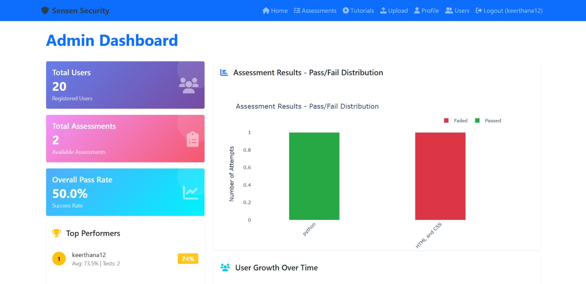
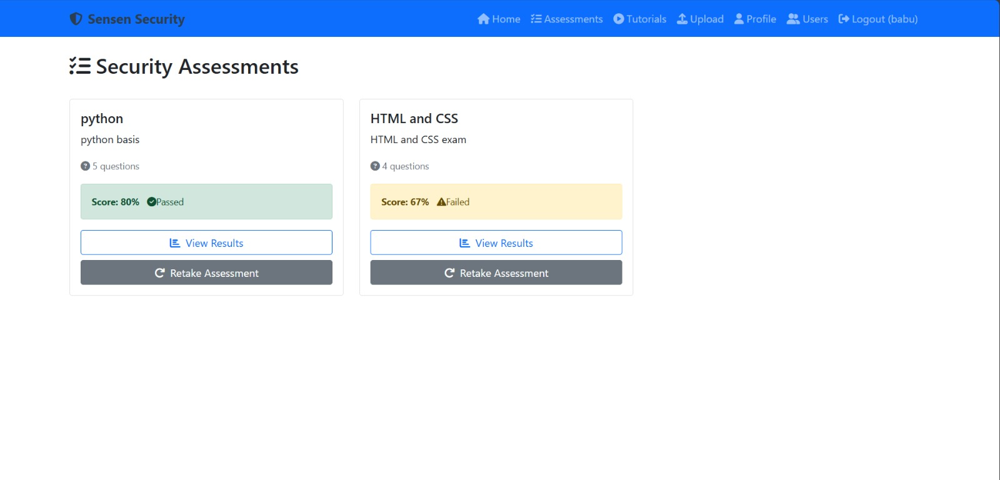
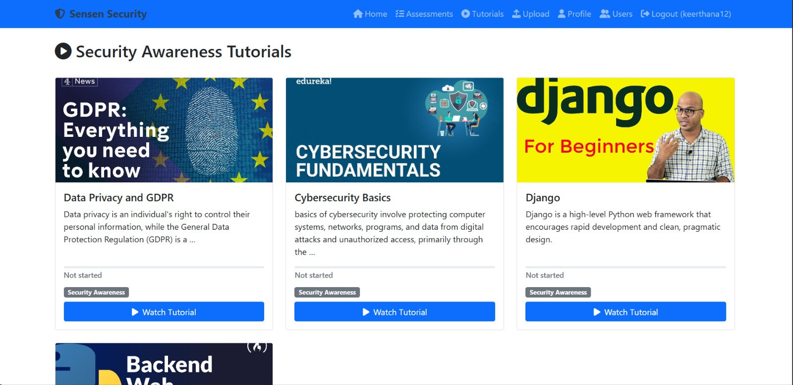
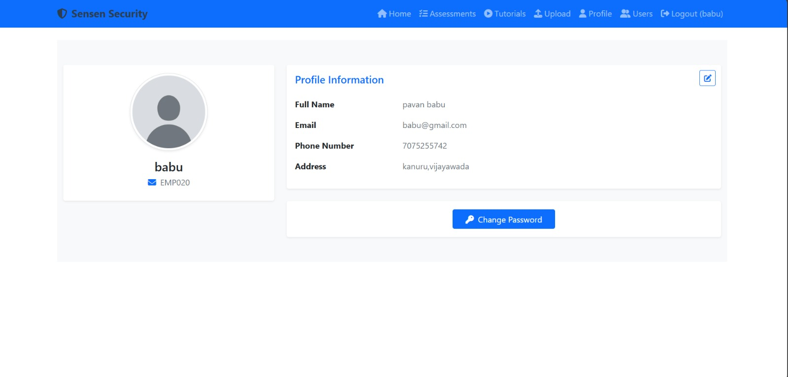

# 🛡️ Sensen Security Awareness App

---

## 📖 Project Overview
**Sensen Security Awareness App** is a web-based platform developed during my internship at **Senen AI**.  
It empowers users to learn security best practices through interactive tutorials and ensures secure assessment processes with **advanced exam controls**.  

This project demonstrates a **full-stack Django application** integrated with **SQLite** for database management and robust front-end features.

---

## 🔹 Key Features

### 🏠 Home / Dashboard
- Personal dashboard displaying:
  - Total assessments attempted
  - Total assessments passed
  - User progress overview  
- Quick navigation to Tutorials, Assessments, and Profile sections  

### 📝 Assessments
- Secure exam environment with:
  - Disabled keyboard shortcuts (Ctrl+C, Ctrl+V, Delete)
  - Tab switching restrictions
  - Locked answers on re-attempts
  - Prevents cheating and ensures integrity  

### 🎥 Tutorials
- Interactive video tutorials on security awareness topics  
- Multi-format video support for learning flexibility  

### 👤 Profile Management
- View and update personal details  
- Profile customization and secure account management  

---

## 🛠️ Tech Stack
| Layer       | Technology           |
|------------|--------------------|
| Frontend    | HTML, CSS, JavaScript |
| Backend     | Python Django       |
| Database    | SQLite              |
| Security    | Robust exam controls, keyboard & tab restrictions |

---

## 🗂️ Project Structure
